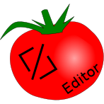
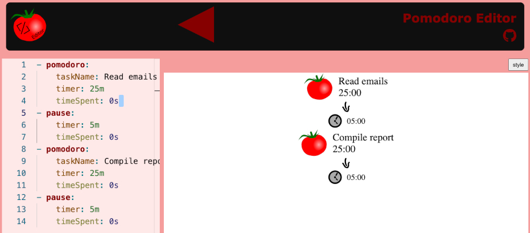
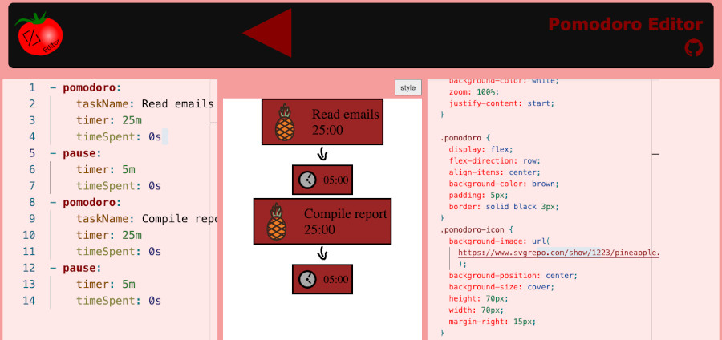
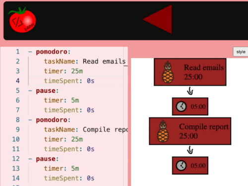

# Pomodoro Timer Editor



An editor to create your pomodoro timer todo declaratively!

[Enter to pomodore editor here](https://angelochecked.github.io/pomodoro-timer-editor/)

# About

Create your pomodoro timer todo



Customize it with css!



START!



# Why?

I thought of using it for obs studio


# Styles

Do you want contribute by adding your style? <a href="https://github.com/AngeloChecked/pomodoro-timer-editor/issues" target="_blank">Submit a proposal here.</a>

# Development

Requirements:
- npm
- nodejs 

Build:
```
npm build:dev
npm build:production
```

Run tests:
```
npm test
```